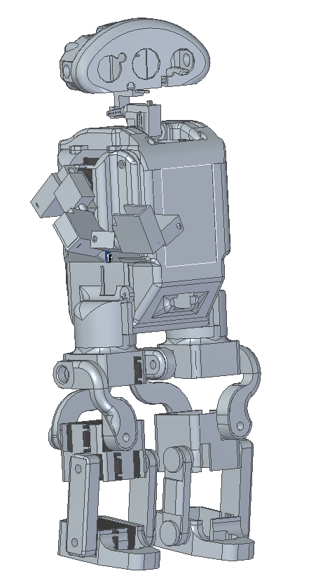

# CWSV5 - Mini Humanoid Robot
## CWS-Overview:
### CWS is a mini humanoid robot developed for collecting world data and interagating with the world.

- [Basic Concept](#Basic-Concept)
- [Electronics](#Electronics)
- [To-Do](#To-Do)

## Basic-Concept
The basic idea is to create a robot who is able to collect world data, like audio, video, ... and then send it to a server. This would be useful to train neural networks. The robot should also look like a human and should be able to walk.

## Electronics
The robots has
- 1 x Raspberry Pi Zero 1
- 1 x Raspberry Pi Pico
- 3 x Microphones
- 26 x Servos, 
    - 5 for every leg, 
    - 6 for every arm,
    - 4 for the head
- 1 x LCD-Touchdisplay
- 3 x Accelerometers
- 1 x Humanoid Air Sensor
- 1 x Air Preasure Sensor
- 1 x Compass
- 3 x Tof Sensors
- 1 x Night Vision Camera
- 1 x 20-000 mAh Power Bank

## To-Do
- [ x ] Concept
- [ x ] Decided what world data should be collected

    ### Digital Concept
    - [ ] Digital 3D Concept finished

    - [ x ] Digitalisation of Sensors

    - [ x ] Legs
        - [ x ] Leg Concept
        - [ x ] CAD of Leg
    
    - [ x ] Body
        - [ x ] Arangement of parts
        - [ x ] CAD of Body

    - [ ] Arms
        - [ ] Concept of Arms
        - [ ] CAD of Arms

    ### Building Process
    - [ ] Building Process finished
        - [ ] Legs
            - [ ] Left Leg
                - [ x ] 3D-Printing of Leg parts
                - [ x ] Assembling of different parts
                - [ ] Wiring

            - [ ] Right Leg
                - [ ] 3D-Printing of Leg parts
                - [ ] Assembling of different parts
                - [ ] Wiring
        
        - [ ] Body
            - [ x ] 3D-Printing of Body parts
            - [ ] Assembling of different parts
            - [ ] Wiring

        - [ ] Arms
            - [ ] Right Arm
                - [ ] 3D-Printing of Body parts
                - [ ] Assembling of different parts
                - [ ] Wiring

            - [ ] Left Arm
                - [ ] 3D-Printing of Body parts
                - [ ] Assembling of different parts
                - [ ] Wiring

    ### Programmed
    - [ ] Programming finished